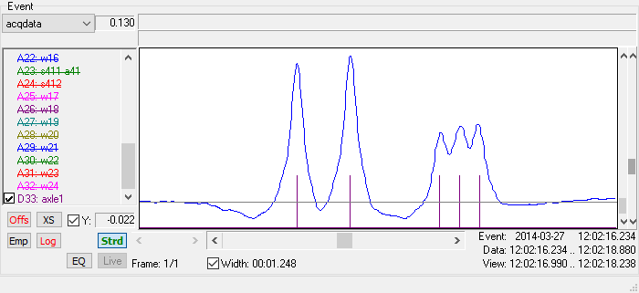
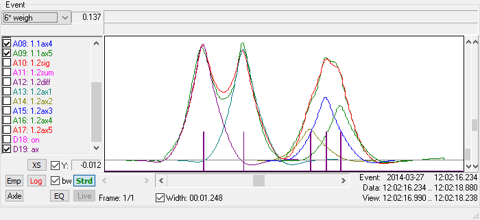
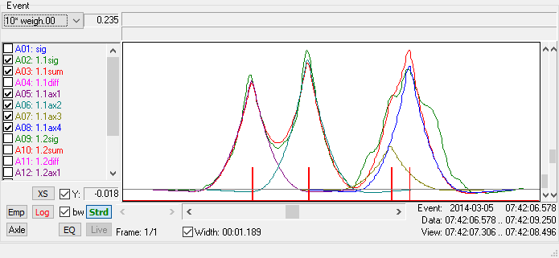
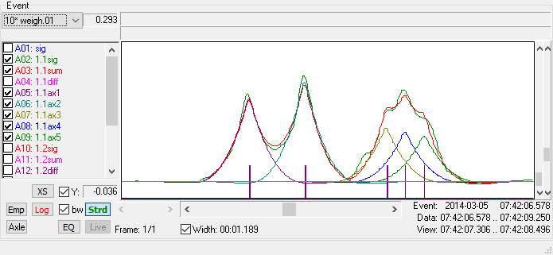
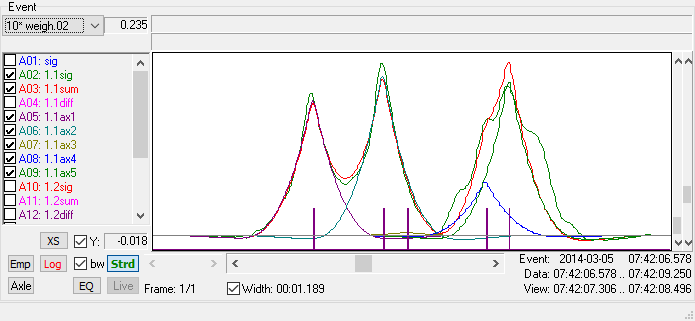

# Možnosti ML na osnih signalih

Na zadnjem sestanku smo debatirali o možnosti ML na osnih signalih. Za detekcijo skupin itak ni težav, problem je identičen tistemu s CV, tudi vhodne podatke imamo vse. Vsekakor se ta del splača poskusiti.

Sledi pa detajlna razlaga podatkov, ki jih imamo na voljo, ter predlog kako bi se z ML vseeno dalo določati tudi pozicije osi.

## Osnovni podatki

SiWIM sistem da od sebe t.i. event-e $E$, kose podatkov, ki vsebujejo zajete signale, diagnostike generirane z različnimi procesnimi moduli ter podatki o vozilih. Simbolično bi relevantno informacijo v event-u zapisal kot $E=E(s, p, x)$, kjer so:

- $s$ signal iz detektorjev osi. To je analogen signali, vzorčeni s 512 vzorci na sekundo.
- $p$ pulzi (palčke), ki jih SiWIM detektira iz signala $s$. To je digitalen kanal, ki je interno predstavljen s spiskom parov, kjer posamezen par predstavlja številko vzorca začetka in konca pulza. Če je vozilo pravilno detektirano, je število pulzov enako številu osi.
- V event-u obstajata dva spiska vozil. Prvi je `detected_vehicles`, ki jih producira modul `vehicle_fad`. Modul `weigh` vzame vozila iz `detected_vehicles`  ter tehtalne signale in z Moses-ovim algoritmom izračuna surove teže. Tako opremljena vozila shrani v `weighed_vehicles`. Vsako vozilo v spisku ima shranjeno spisek medosnih razdalj $x$.

Primera signalov `s` (z modro) in `p` (z vijolično) sta na sledeči sliki:

To ustreza vlačilcu s skupinami osi 113 in z medosnimi razdaljami $[3.5, 5.8, 1.4,	1.3]$ (v metrih).

## Obdelava

Obdelava od detektiranih vozil do končnih podatkov poteka v več korakih:

### Neposredno tehtanje vozil

Prvi korak je neposredno tehtanje vozil. To se izvede tako, da se na merjeni signal $g(t_j); j=1\ldots M$, kjer je $M$ število vzorcev, prilagaja funkcijo $f(t_j) = \sum_{i=1}^N A_i I(v_i(t_j - t_i))$,  kjer je $N$ število osi, $A_i$ posamezni osni pritisk, $I()$ vplivnica, $v_i$ hitrost $i$-te osi in $t_i$ prihod $i$-te osi v izhodišče. Z variiranjem $A_i$ se minimizira $\chi^2 = \sum_{j=1}^{M}(g(t_j) - f(t_j))^2$ in na ta način izračuna osne pritiske.

Pri tehtanju se generira tudi diagnostika za tehtanje. Primer diagnostike za isti event, kot na prejšnji sliki, je:

Pulzi pri pozicijah osi so vijolični, merjeni signal $g(t)$ je zelen, prilagajani signal $f(t)$ rdeč.  Ostalih 5 signalov so vplivnice na pravih mestih, pomnožene s posameznim osnim pritiskom — vsota teh signalov je $f(t)$.

Simbolično lahko napišemo da je tehtanje preslikava $W: E(s, p, x) \mapsto E(s, p, q, x)$, kjer smo s $q$ označili pulze za osi uporabljene za tehtanje. Pri osnovnem tehtanju je $q=p$.

### Rekonstrukcija vozil

Ideja je sledeča:

1. Izračunajo se osni pritiski z detektiranimi osmi in  zabeleži $\chi_0^2$.
2. Osne razdalje se primerja s spiskom pravil. Vsako pravilo vsebuje skupine osi ter minimalne in maksimalne medosne razdalje. Če bi vozilo, na primer, imelo namesto skupin 113 skupine 112 in bi medosne razdalje bile znotraj meja, bi se dodalo eno os na razdalji $1.35m$ pred in/ali tretjo osjo (odvisno od konkretnih razdalj), in tako "rekonstruirano" vozilo zopet stehtalo.
3. Tako dobljen $\chi_1^{2}$  se primerja s $\chi_0^2$ in, v kolikor je je $\chi_1^2$ manjši od $\chi_0^2$ in je relativna razlika večja od neke pred-določene vrednosti (po navadi 5%), se to rekonstruirano vozilo vzame kot novega kandidata za rekonstruirano vozilo.
4. Korake 2.-3. se ponavlja dokler vozilo še ustreza kakšnemu pravilu.
5. Kandidata pri katerem se $\chi^2$ najbolj zmanjša, se vzame kot rekonstruirano vozilo.

Rekonstruiranim vozilom se nastavi zastavica `Flag_Vehicle_Reconstructed`.

Primer rekonstrukcije je na naslednjih slikah. Na prvi je prikazano tehtanje z detektiranimi osmi (narisanimi z rdečo).

Vidi se, da je prvi del (vlačilec) v redu, pri polpriklopniku pa se prilagajana funkcija ne ujema najbolje. Na naslednji sliki je prvi poskus rekonstrukcije, pri katerem se doda zadnjo manjkajočo os v skupini. Ujemanje je že na oko precej boljše.

Nazadnje je poskus, pri katerem se drugi osi doda se eno os v skupino. To os je bila pri tehtanju izračunana skoraj 0, pri skupini pa je še vedno slabo ujemanje.

Ker je bilo zmanjšanje $\chi^2$ največje pri pri prvem poskusu, je ta poskus tudi obveljal — končno vozilo ima skupine 113.

Če gledamo na rekonstrukcijo kot na preslikavo $R$, lahko napišemo $R: E(s, p, q, x) \mapsto E(s, p, q', x')$, pri čemer velja $x=x'$ in $q=q'$, če ne pride do rekonstrukcije. V nasprotnem primeru pa $q'$ vsebuje nove pulze, $x'$ pa nove medosne razdalje. V tem konkretnem primeru se število pulzov spremeni iz 4 v 5, $x=[3.9, 5.8, 1.3 ]$ pa v $x'=[3.9, 5.8, 1.3, 1.4]$.

### Skripta QA

Čez tako dobljene podatke se zapelje Python skripta `qa.py`. Na osnovi hevrističnih pravil, nekaj povzetih iz projekta *BridgeMon*, nekaj pa dodanih z Alešem, se vsakemu vozilu nastavi ena izmed zastavic: zelena, oranžna ali rdeča. Zelena vozila so skoraj zagotovo OK, rdeča je zagotovo treba preveriti, oranžna pa so nekje vmes.

Signali in medosne razdalje se v tem koraku ne spreminjajo.

### Strojni popravki

Tako stehtana vozila gredo skozi Python skripto `fix.py`, ki na podlagi hevrističnih pravil popravi vozila. Eden izmed vhodnih podatkov je tudi zastavica iz koraka QA. Simbolično lahko napišemo $F: E(s, p, q', x') \mapsto E(s, p, q', x'')$, kjer se $x'$ in $x''$ lahko razlikujeta, če pride do popravka v lokacijah osi vozila. Lahko pa se, npr., spremeni samo kak osni pritisk, kar nas tukaj ne zanima — v tem primeru sta $x'$ in $x''$ enaka.

Žal pa se $q'$, tudi v primeru popravka medosnih razdalj, ne spremeni. V času, ko je bila pisana skripta, še ni bila napisana knjižnica *SiWIM-Pi*, s katero je moč brati, pisati in popravljati tudi event-e. Vse spremembe so se dogajale samo na tekstovnih NSWD datotekah, niso pa se mogle propagirati nazaj v event-e.

Popravljenim vozilom se nastavi zastavica `Flag_QA_Fixed`, 

### Ročni popravki

Nazadnje so se za Šentvid vozila pregledala in potrebi ročno obdelala s programom *SiWIM-D*. Tam je možno premikati osi levo, desno, gor, dol,... vozila združiti, ločiti,.., Pregledana niso bila vsa vozila, temveč tista najbolj kritična — z rdečo zastavico.

Simbolično $H:E(s, p, q', x'') \mapsto E(s, p, q''', x''')$. Spremenjenim vozilom se lahko nastavi ena ali več zastavic izmed `Flag_Classification_Manually_Changed` , `Flag_First_Axle_Position_Manually_Adjusted`  in `Flag_Axles_And_Loads_Manually_Adjusted`. [^1]

V primeru ročnih popravkov se tudi lokacije osi spremenijo iz $q'$ v $q'''$. Vendar, kot sem že kakšno leto nazaj razložil, je pri premetavanju in shranjevanju podatkov prišlo do napake in event-i so izgubljeni. Zato je največ, kar imamo na Šentvidu, $E(s, p, q', x''')$, se pravi potencialno rekonstruirani osni pulzi iz koraka rekonstrukcije, $q'$, brez informacije o strojnih in ročnih popravkih, ter strojno in ročno popravljene medosne razdalje.

Tudi če bi imeli shranjene signale $q'''$, nam to samo po sebi ne bi pomagalo, saj nismo pregledali vseh vozil. Pa tudi, če je bilo vozilo videno, ne pa popravljeno, se to ni nikjer zabeležilo. To pomeni, da bi zagotovo vedeli le, če je vozilo bilo popravljeno. Če pa ne bi bilo označeno, bi to lahko pomenilo, da je bilo videno in je OK, ali pa da ni bilo videno in je napačno.

### Ročno preverjanje 

Nazadnje smo za pripravo ground truth CV ML podatkov iz množice vseh primernih meritev (shranjenih v datoteki `recognized_vehicles-ORIGINAL.json`, ki jo je zgeneriral Domen) izbrali samo tista vozila, ki so na pasu 1. Potem smo s pomočjo GUI skripte `label_braid_photos.py` pregledali precej fotografij, jih preverili in primerno označili.

Označena vozila lahko razdelimo v množici pravilno in nepravilno detektiranih vozil. Če je $x=x'''$, je vozilo v $\mathbb P$, drugače je v  $\mathbb N$. Iz tega je nastala datoteka `metadata.hdf5`, ki jo je Domen uporabil kot vhod za treniranje NM, skupaj s fotografijami vozil.

## Rekonstrukcija signala $q'''$

Če sem prav razumel, je problem v tem, da se pri vseh teh preslikavah transformira samo $x\mapsto x'''$, s čemer dobimo prave medosne razdalje, nimamo pa tudi $q\mapsto q'''$. Zato se ne da trenirati NM, da bi znal iz $s$ predvideti $q$, Učil bi se samo na pravilno detektiranih primerih, ne pa tudi kako iz "zoprnih" signalov dobiti prave osi. Ampak mislim, da bi se dalo ta problem zlahka zaobiti. Za vozila iz množice $\mathbb P$ je zadeva preprosta, $q'''$ je kar $q$, oziroma $p$.

Za vozila iz množice $\mathbb N$ pa bi bilo treba rekonstruirati $q'''$. Za to pa pride v poštev Andrejeva ideja z uporabo, npr., prve medosne razdalje kot referenco. Verjetno nikoli (ali pa vsaj v samo izjemno majhnem deležu primerov) namreč niso spremenjene prav vse medosne razdalje. Med medosnimi razdaljami $x$ in $x'''$ bi se poiskalo pare enakih medosnih razdalj in s pomočjo teh (ali verjetno najdaljše ustrezajoče izmed teh) določilo skalo signala $q$. S tem in z $x'''$ pa so dani vsi podatki, s katerimi bi se dalo rekonstruirati signal $q'''$, ki bi bil, poleg signala $s$, vhod v NM.

Tako imamo, PMSM, vse potrebne podatke, da bi iz signala lahko dobili pulze za določanje pozicij osi in s tem za boljše tehtanje. V naslednjih razdelkih so opisani koraki do nabora podatkov, ki so primerni za treniranje NM. Zaradi preprostosti in ločevanja dolgotrajnih postopkov so uporabljene tri Python skripte.

### Izbira vozil

Skripta `nn_vehicles.py` je namenjena izbiri vozil. Vhodni podatki so:

- Datoteki `braid.nswd` v direktorijih `rp01` in `rp03`, v katerih so podatki o vozilih po tehtanju in rekonstrukciji ter po strojnih in ročnih popravkih
- `metadata.hdf`, zbirka podatkov o pregledanih vozilih (glej [lbp.pdf](..\lbp\lbp.pdf)  za detajle)
- Datoteka `recognized_vehicles.json`, ki povezuje timestamp vozila in vnos v `metadata.hdf`

Najprej je izmed vseh podatkov o vozilih treba izbrati primerne za učenje NM. Iz datotek `NSWD` smo izbrali tiste s pasu 1, ki so v obeh datotekah. To je nujno, ker strojni in ročni popravki včasih razdelijo vozila na eno ali več vozil ali združijo dve vozili v eno. Hkrati smo izločili vozila, ki niso sama na pasu 1, ne glede na to, ali je večkratna prisotnost ali ne. Izkazalo se je, da je pri takšnih vozilih včasih prišlo do zmede pri pregledovanju in bolj varno je, da se jih izloči. Od vseh vozil nam jih tako ostane 199820.

Od teh je treba izbrati samo tista vozila, ki so v datoteki `metadata.hdf5`, skupaj 166551 vozil. Izmed teh smo izločili 125161 vozil, ki niso bili ročno preverjeni (polje `seen_by` je prazno). 

Ostane 41390 videnih vozil, od katerih se pri 34087 grupe osi na fotografiji ujemajo z grupami osi v podatkih, pri 7303 pa ne. Vendar to število zajema tudi 6141 vozil z dvignjeno osjo (polje `raised_axles` v `metadata.hdf5` ni prazno), kjer osi preprosto ne moremo detektirati. Ostane 1162 vozil pri katerih niti rekonstrukcija, ne strojni ali ročni popravki niso pravilno določili grupe osi. To je približno 2.8% vozil, pri katerih bi lahko NM morda izboljšala detekcijo.

Rezultat neposredne izbire podatkov je datoteka `nn_vehicles.json`, spisek vozil z njihovimi atributi:

Format datotek je enak: spisek vnosov, kjer so v vsakem vnosu polja:

- `ts`: Timestamp vozila

- `ts_str`: Berljiv timestamp vozila

- `ets`: Timestamp ustrezajočega event-a

- `ets_str`: Berljiv timestamp ustrezajočega event-a

- `photo_match`: Zastavica ki potrdi ujemanje skupin osi na fotografiji in v podatkih. Če je zastavica `False`, se pojavijo dodatna polja:

  - `axle_groups`: Skupine določene v metapodatkih
  - `raised_axles`: To polje je prisotno, ko je prisotno tudi v metapodatkih — če ima vozilo dvignjene osi. S tem lahko ločimo neujemanje zaradi napačne detekcije osi in dvignjenih osi.

- `vehicle`: Dict z dvema vnosoma: `weighed` opisuje vozilo iz direktorija `rp01`, `final` iz `rp03`. V obeh so polja

  - `axle_groups`: Skupine osi
  - `axle_distance`: Spisek medosnih razdalj
  - `axle_weight`: Spisek osnih pritiskov
  - `rcn`: Zastavica, ki označi ali je vozilo plod rekonstrukcije
  - `fix`: Zastavica, ki pove ali je bil izveden strojni popravek
  - `man`: Zastavica, ki pove ali je bil izveden ročni popravek

  V vozilu `final` sta dodatni dve polji, `distance_op`, ki ima lahko vrednosti:
  - `nop`: Medosne razdalje se niso spremenile (40519 vozil)
  - `mov`: Vozilu so se osi samo premaknile. To je načeloma posledica ročnega popravljanja (281 vozil)
  - `add`: Vozilu so se osi dodale (138 vozil)
  - `del`: Vozilu so se osi pobrisale (452 vozil)

  ter polje `weight_op`, katerega vrednost je lahko:

  - `nop`: Če so osni pritiski nespremenjeni
  - `chg`: Če so osni pritiski spremenjeni
  - `undef`: Če se je število osi spremenilo in osnih pritiskov ne moremo primerjati

### Reprocesiranje event-ov

Za učenje NM so potrebni signali iz katerih SiWIM konstruira osi. Žal so bili ti podatki deloma izgubljeni, deloma pa jih s starejšimi verzijami SiWIM-a niti ni bilo možno generirati.

Dodatno oviro je postavljalo dejstvo, da smo za detekcijo osi uporabili signala iz dveh detektorjev osi. Opazili smo namreč, da je so včasih vrhovi precej bolj izraziti na enem, včasih na drugem. Algoritem za uporabo obeh signalov deluje tako, da se izbere dominantni detektor, s pomočjo navzkrižne korelacije določi zamik med njegovim signalom in signalom drugega detektorja, signal z drugega detektorja ustrezno premakne, ter za detekcijo uporabi povprečje obeh signalov.

Žal pa zaradi prihranka prostora na disku (ki je bil 10 let nazaj precej dražji) nismo v event-e dali shraniti diagnostike za detekcijo osi.

Zato smo iz starih event-ov prebrali nastavitve in z njimi ponovno procesirali event-e, tokrat z vklopljenim generiranjem diagnostik. Žal ni bilo moči reproducirati tudi tehtanja, ker smo pri kasnejših obdelavah spreminjali vplivnico, le-ta pa se takrat ni shranjevala ob spremembah. Izbira vplivnice pa ima močen vpliv na rekonstrukcijo in s sedanjo vplivnico je bilo nemogoče reproducirati staro tehtanje.

### Ekstrakcija signalov in osnih pulzov iz event-ov 

Naslednji korak opravi skripta `nn_axles_and_signals.py`. Vhodni podatki so:

- Datoteka `nn_vehicles.json` iz prvega koraka
- Originalni event-i za branje osnih pulzov
- Reprocesirani event-i za branje osnih signalov

Skripta za vsako izmed vozil prebere ustrezna event-a in iz njiju ekstrahira želene podatke.

V izhodni datoteki `nn_axles.json` so vnosi iz `nn_vehicles.json` razširjeni s sledečimi polji:

- Dict `vehicle` se razširi z vnosom `detected` za detektirana vozila (pred tehtanjem in predvsem rekonstrukcijo)
- Vnosoma `detected` in `weighed` v prejšnjem dict-u se doda polje `axle_pulses`, dobljeno iz list `detected_vehicles` in `weighed_vehicles` iz originalnega event-a
- Vnosu `weighed` se doda `distance_op`, z istim pomenom, kot v vnosu `final`

V izhodni datoteki `nn_signals.hdf5`  pa so zbrani signali. Za vsako vozilo je kreirana grupa, katere ime je berljiv timestamp vozila, npr., `2014-03-12-14-34-07-337`. Znotraj grupe so spravljeni `numpy` array-ji:

- `s111`: Prvi signal za detekcijo osi.
- `s112 a11`: Drugi signal za detekcijo osi.
- `11admp`: Kombinirani signal za detekcijo osi.
- `11admp''`: Signal z odšteto envelopo. Ideja je, da se najde minimum signala `11admp`, konstruira trikotnik skozi začetno točko signala, minimum ter končno točko signala, ter ta trikotnik odšteje od signala. Rezultat je ta, da se znebimo precejšnjega dela negativne komponente signala.
- `11avg1`: Prvo drseče povprečje signala `11admp''` z dolžino povprečenja enako 1.1&nbsp;m
- `11avg2`: Drugo drseče povprečje signala `11admp''` z dolžino povprečenja enako 0.3&nbsp;m.
- Razlika `11diff = 11avg1 - 11avg2`, ki je osnova za algoritem za detekcijo. 

### Generiranje pulzov za končno verzijo vozil

Za detektirana in tehtana vozila imamo na voljo pulze iz event-ov, za končna vozila pa žal ne. Zato jih je bilo treba generirati iz drugih podatkov.

Vhodna datoteka je samo ena, `nn_axles.json` iz prejšnjega koraka, izhodna datoteka pa `nn_pulses.json`, v kateri so razširjeni vnosi. Algoritem je sledeč:

- S pomočjo `difflib.SequenceMatcher` se poišče podobnost med medosnim razdaljami `weighed` in `final` vozil
- Če se niti ena medosna razdalja ne ujema, vozilo ni kandidat za učenje in polje `eligible` se nastavi na `False`. Takšnih vozil je 161.
- V preostalih 41229 primerih se poišče najdaljši ujemajoči se odsek medosnih razdalj. S pomočjo tega in osnih pulzov iz `weighed` se izračuna faktor skaliranja med medosnimi razdaljami in razdaljami med pulzi. Faktor je odvisen od hitrosti vzorčenja in hitrosti vozila.
- V polje `axle_pulses` za vnos`final` v dict-u `vehicle` se najprej prepiše tiste pulze iz `weighed`, ki so v najdaljšem ujemajočem se odseku, ostale pulze pa generira s pomočjo medosnih razdalj in faktorja skaliranja.

### Učenje

Na tem mestu imamo za vsa primerna vozila:

- Signale iz detektorjev osi
- Osne pulze

Imamo 34087 vozil za treniranje NM ter 1162 vozil na katerih lahko preverimo uspešnost. 

SiWIM algoritem deluje na razliki `11diff`. Vendar je pot do tega signala že sama po sebi "obremenjena" s hevristiko, predvsem pa je potrebno določiti nekaj parametrov, ki so ključnega pomena pri detekciji osi. Morda bi bilo smiselno poskusiti kar neposredno s signalom `11admp''`, katerega generiranje skoraj nič ni odvisno od človeka.

Treba je omeniti, da v metapodatkih *ni* podatka o dejanskih pravilnih medosnih razdaljah, temveč samo o pravilnih skupinah osi. Vendar je v tej fazi tudi da podatek pomemben in dober indikator delovanja NM. Število testnih vozil pa je tudi dovolj majhno, da lahko ročno pregledamo rezultate.

[^1]: Pri pripravi datoteke `grp_and_fixed.hdf5`, poslane 3.12.2024, o kateri smo tudi včeraj govorili, sem pozabil na te zastavice. Bom, ko vzpostavim ML PC doma, še enkrat vse skupaj zgeneriral. Vidim, da sem tudi v `metadata.hdf` po nepotrebnem združil zastavice za ročne spremembe z zastavico `Flag_QA_Fixed`. Bom tudi to popravil, da bosta to ločena podatka.
