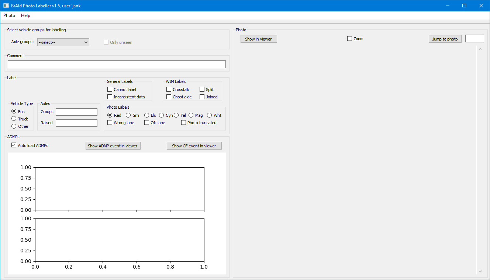
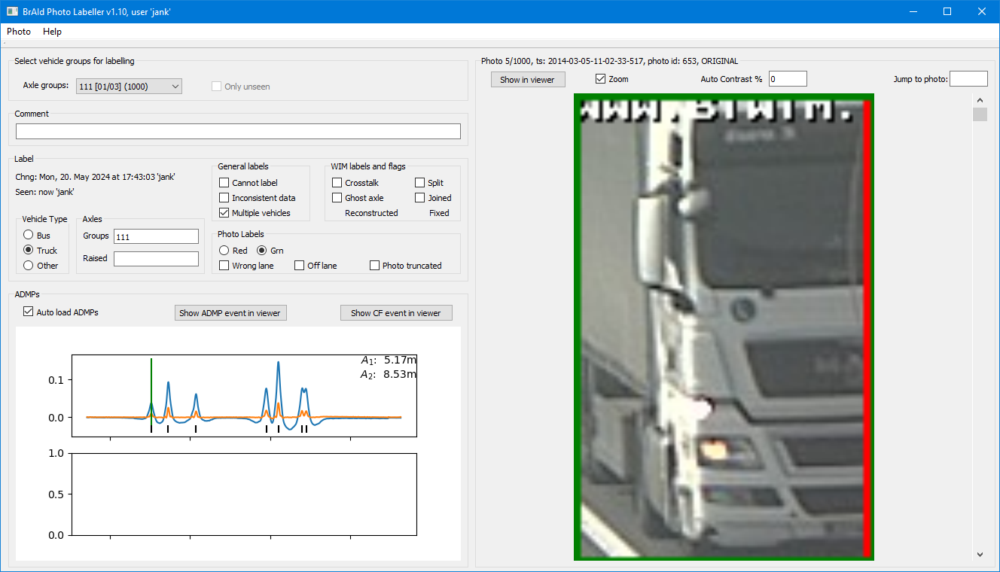

# Navodila za uporabo LBP (Label Braid Photos)

Jan Kalin <jan.kalin@zag.si>

**Zgodovina izdaj aplikacije in dokumentacije**

v1.7, 14. maj 2024

- Dodane so [smernice za označevanje](#smernice-za-označevanje)
- Uvedena je oznaka *Multiple vehicles*, opisana je pri [splošnih oznakah](#splošne-oznake)
- Dodani sta oznaki *Reconstructed* in *Fixed* ter opis le-teh v razdelku [rekonstruirane in popravljene osi](#rekonstruirane-in-popravljene-osi)
- Gumb za [hitro izbiro fotografije](#izbira-fotografije) je odstranjen. Namesto tega se sliko izbere s tipko `<Enter>` v vnosnem polju
- Bugfix: pri praznem spisku medosnih razdalj (posledica diskrepance med NSWD in EVENT datotekama zaradi popravkov osi) je prišlo do prekinitve izvajanja aplikacije

v1.6, 14. maj 2024

- Dodana funkcija [*Zoom*](#zoženje-pogleda-(zoom))

v1.5, 13. maj 2024

- Dodano vnosno polje *Jump to photo* za hitro izbiro fotografije

v1.4, 10. maj 2024

- Premešan interface, sedaj se slika veča z oknom

v1.3, 27. april 2024

- Predelava za novo označevanje (brez grupiranja v avtobuse in tovornjake)
- Dodan tip `Other`, oznake barv, komentar,….

v1.2, 29. marec 2024

- Dodana razlaga ADMP/CF  v razdelku ADMPs

v1.1, 27. marec 2024

- Velike množice vozil (npr., tovornjaki s skupinam 113) so razdeljene na podmnožice moči 1000.
- Bližnjice so brez `<Alt>`
- Nov način opisovanja dvignjenih osi
- Dodana oznaka **Nekonsistentni Podatki**

v1.0, 20. marec 2024

- Začetna izdaja

## Uvod

Ta dokument opisuje uporabo vizualne aplikacije Label Braid Photos, ki se uporablja za označevanje fotografij vozil stehtanih z SiWIM B-WIM. Namen aplikacije je označiti napačno označene fotografije, skupaj z napačno detektiranimi vozili, da se zgenerira "ground truth" nabor podatkov za učenje AI.

## Namestitev

### Python

Aplikacija je napisana v Pythonu in testirana z verzijo 3.9. Načeloma bi novejše verzije morale tudi podpirati to aplikacijo. Prvi korak je torej inštalacija Pythona.

### Zunanje Python knjižnice

Poleg knjižnic, ki se inštalirajo kot del osnovne inštalacije Pythona, aplikacija uporablja še zunanje knjižnice: `matplotlib`, `PyQt5`, `numpy` in `pandas`. Te je treba inštalirati, detajli so odvisni od distribucije Pythona.

### Lokalne Python knjižnice

Za branje SiWIM binarnih datotek se uporablja `siwim-pi`. Dostopen je na `M:\disk_600_konstrukcije\JanK\siwim-pi`. Če se poganja aplikacijo direktno z diska `M:`, inštalacija ni potrebna, drugače se odpre `cmd` v tem direktoriju in požene `pip install .` (pika je pomembna).

### Skripta in podatki

Skripta se nahaja na `M:\disk_600_konstrukcije\JanK\braid_photo\label_braid_photo.py`. 

V direktoriju `M:\disk_600_konstrukcije\JanK\braid_photo\data` so podatki:

- `*.nswd` v katerih so podatki o stehtanih vozilih
- `recognized_vehicles.json` vsebuje podatke o vozilih, ki jih je kategorizirala AI aplikacija
- `vehicle2event.json` vsebuje povezavo med vozilom in *event*-om — binarno datoteko v kateri so shranjeni signali in ostala informacija.
- Najpomembnejša datoteka je `metadata.hdf5`, v katero se shranjujejo rezultati ročnega označevanja vozil. Če se izgubi ali pokvari ta datoteka, bo ves do tedaj vložen trud zaman.

Če je Python pravilno inštaliran, bi moral dvoklik na skripto le-to zagnati.

### Predpriprava na zagon

Za polno funkcionalnost aplikacije je treba priklopiti nekaj omrežnih diskov pod točno določenimi imeni:

- `\\mn-620-modeli.zag.si\siwim` kot `S:`
- `\\mn-620-modeli.zag.si\nfs-siwim` kot `T:`
- `\\mn-620-modeli.zag.si\braid` kot `B:`

V kolikor ne morete priklopiti diskov se oglasite pri avtorju.

Opozorilo: po reboot/sleep/hybernation,... je treba klikniti na vsakega izmed teh diskov v Explorerju. Windows imajo namreč to grdo navado, da disk dejansko priklopijo šele potem, ko v Explorerju klikneš nanj. Če pa poskuša kakšna aplikacija priti do diska pred tem, pride do napake.

## Uporaba aplikacije

### Zagon

Pri zagonu aplikacije se odpre konzola (`CMD` okno), v katerem se najprej izpiše

```
Loading recognized_vehicles.json, done.
Loading vehicle2event.json, done.
```

potem pa se pojavi glavno okno aplikacije. 

Konzole ne zapirajte, saj se s tem zapre tudi glavno okno.  V konzoli se tudi izpišejo nekatere napake pri izvajanju (recimo da neke datoteke ne more najti), pa tudi, če pride do kakšne napake pri samem izvajanju aplikacije.

Če se zgodi to, prosim avtorju pošljite screenshot konzole in opis tega, kaj ste delali, ko je do napake prišlo.

#### Zagon aplikacije z ročnim odpiranjem konzole

Težava pri zaganjanju z dvoklikom na `.py` datoteko je, da se pri napaki v aplikaciji zapre tudi konzola, s tem pa tudi izgine informacija o napaki. TBD je prestrezanje takšnih napak, vendar to ni najlažje.

Zato je bolje aplikacijo zagnati tako, da se konzolo ročno odpre —  [10 načinov kako se zažene konzolo](https://www.howtogeek.com/235101/10-ways-to-open-the-command-prompt-in-windows-10/) — potem pa v konzoli vtipka sledeče vrstice in vsako zaključi z  `<ENTER>` :

- `M:`
- `cd \disk_600_konstrukcije\JanK\braid_photo`
- `python label_braid_photos.py`

Pri napaki se bo izpisal t.i. *stack trace* — spisek klicev funkcij in vrstic kje je šlo kaj narobe.  Primer:
````
M:\disk_600_konstrukcije\JanK\braid_photo>python label_braid_photos.py
Loading recognized_vehicles.json, Traceback (most recent call last):
  File "M:\disk_600_konstrukcije\JanK\braid_photo\label_braid_photos.py", line 71, in <module>
    rvs_loaded = json.load(f)
  File "C:\Python39\lib\json\__init__.py", line 293, in load
    return loads(fp.read(),
OSError: [Errno 22] Invalid argument

M:\disk_600_konstrukcije\JanK\braid_photo>
````

To prosim prekopirajte — tekst se označi s potegom z miške s pritisnjeno levo tipko in spravi na clipboard s tipko `<Enter>` — in pošljite avtorju.

Potem lahko aplikacijo zoper poženete z `<Up-Arrow>` in `<Enter>`.

### Glavno okno



#### Meni

V meniju sta dve postavki. `Photo` vsebuje postavke za premikanje po fotografijah in nastavljanje oznak, vendar so vse postavke dosegljive tudi s pomočjo bližnjic. Za hitro pomoč je spisek  bližnjic dosegljiv v meniju `Help|Shortcuts`.

#### *Select vehicle groups for labelling*


Tukaj se izbere množico vozil za označevanje. Struktura podatkov o slikah je bila določena na FAMNIT na osnovi uporabe AI klasifikacije slik, tega se drži tudi aplikacija. Glavna delitev na je skupine osi vozil. Primer je 113, ki predstavlja klasičen vlačilec s polpriklopnikom (šleper po domače).

Velike množice vozil (npr., tovornjaki s skupinami 113) so razdeljene na podmnožice moči 1000. S tem je lažje načrtovati in razdeliti obdelavo med več ljudi, saj je obdelovanje različnih podmnožic varno. Hkrati pa predvidevamo, da 1000 vozil predstavlja za približno uro dela, če predpostavimo 3.6 sekunde za povprečen pregled in morebitni popravek enega vozila. V tem primeru so vnosi v polju *Axle groups:* oblike, npr., `113 [02/13] (1000)`, kar pomeni druga podmnožica (z močjo 1000) izmed 13 podmnožic vozil s skupinami 113.

Potrditveno polje *Only unseen* omogoča nalaganje samo tistih slik, ki jih še noben ni videl. Trenutno je ta možnost onemogočena, ker zmeša oštevilčenje slik. Ponovno bo omogočena skupaj z možnostjo *Only with comments*.

Ko je slika naložena, jo je možno s klikom na *Show photo in viewer* naložiti v eksterni pregledovalnik slik.

#### *ADMPs*

V tem razdelku se lahko vidi signale iz detektorjev osi (ADMP kanalov). Primer je na sledeči sliki.


Zgornji graf je za pas 1, spodnji za pas 2. Na grafih je z modro narisan originalni signal, z oranžno filtriran signal, s črnimi črtami detektirane osi, ter z zeleno črto timestamp obravnavanega vozila. Ob desnem robu so izpisane medosne razdalje vozila.

Z odkljukanim izbirnim poljem *Auto load ADMPs* se signali naložijo avtomatično, skupaj s sliko. Drugače je potrebno pritisniti `D`.

S tipkama *Show ADMP event in viewer* in *Show CF event in viewer* se lahko signale pregleda v zunanjem pregledovalniku SiWIM eventov. Dve možnosti sta zato, ker v *CF* event-ih ni diagnostike za  detektorje osi, v *ADMP* event-ih pa ni diagnostike o tehtanju.

Pri pretehtavanju vozil so šli podatki nazadnje skozi modul `cf`, ki surove teže pomnoži s kalibracijskim faktorjem. Vendar je bilo v teh datotekah izklopljeno shranjevanje diagnostik za detekcijo osi. Za potrebe projekta sem spustil vse originalne event-a še skozi generiranje diagnostik za ADMPje, ni pa šlo skozi tehtanje.

#### *Photo*

Ko se izbere skupine osi, se v razdelku *Photo* takoj pojavi prva fotografija znotraj te grupe. Primer je na naslednji sliki:


V imenu razdelka je napisana zaporedna številka vozila, število vseh vozil, timestamp vozila, ID fotografije ter *ORIGINAL*, če oznake slike niso bile spremenjene ali `CHANGED`, če so bile. Na vrhu razdelka je izpisano uporabniško ime zadnjega, ki je fotografijo videl ter, če so bile oznake spremenjene, ime uporabnika, ki je zadnji spreminjal oznake.

###### Izbira fotografije

Slike se lahko izbira s puščico gor — `<Up>` ali dol — `<Down>`.  Lahko pa tudi s klikanjem na drsni trak poleg slike.

Za lažjo izbiro slike je možno vpisati številko slike v vnosno polje zgoraj desno in s pritiskom na tipko *Jump to photo* neposredno izbrati to sliko.

###### Zoženje pogleda (zoom)

Možno je tudi zožiti pogled (zoom) na okvirček ali ga razširiti nazaj na celo sliko. To se naredi s klikom na izbiro polje *Zoom* ali z bližnjico `<Z>`. Če se spremeni izbira barve oznake, se spremeni tudi pogled. Primera sta na naslednjih slikah:




#### Nastavljanje oznak

V zgornjem delu razdelka *Label* so polja s katerimi lahko spreminjamo oznake. Skoraj vsa polja imajo asociirano bližnjico, ki je bila izbrana tako, da minimizira porabljen čas in premikanje prstov na tastaturi.

Takoj, ko se zabeleži sprememba katere izmed oznak, se ta sprememba napiše v datoteko `metadata.hdf5`. S tem je možnost, da bi stran vrgli delo, minimalna.

##### Mnogotera vozila

AI včasih detektira več vozil. V tem primeru je najbolj verjetno vozilo označeno z rdečim kvadratom, potem pa si sledijo zelena, morda, cyan, rumena, meganta in bela. Prikazane so samo oznake, ki so tudi prisotne na sliki.

To je prva oznaka, ki jo je treba nastaviti, če je to potrebno.

##### Tip vozila

Tip lahko določimo s tipkami `B` za ***B**us*,  `T` za ***T**ruck* in `O` za ***O**ther*. Nekateri tovornjaki, ki jih je AI napačno klasificiral kot avtobus, imajo že nastavljeno to izbirno polje (na osnovi skupin osi)

##### Osi, grupe in dvignjene osi

V polju *Groups* se prikažejo trenutno detektirane skupine osi, npr., 113. Če se izkaže, da je SiWIM napačno detektiral osi, se tukaj popravi v pravilno vrednost. Sprememba se takoj zapiše med metapodatke. V polju obstaja tudi "undo", s klasično tipko `<Ctrl>-Z`. 

V polju *Raised* se navede grupo v kateri je dvignjena os. Tipičen primer je, ko šleper dvigne prvo os v trojčku na polpriklopniku. Tedaj bi SiWIM detektiral skupine 112. V tem primeru v polje *Raised* vpišemo vrednost `3` (ker je manjkajoča os v tretji skupini osi). Lahko je dvignjenih več os, tedaj z vejico ločimo grupe z dvignjenimi osmi. V fiktivnem primeru, ko bi polpriklopnik dvignil dve osi v trojni osi, pa še vlekel bi priklopnik z eno dvignjeno osjo od dveh, bi v polje vnesel `3,3,4`.

Pri spreminjanju polja *Raised* aplikacija samodejno popravi vrednost v polju *Groups*, v tem primeru bi se skupine 112 spremenile v 113.  Po tem je seveda možno še ročno popraviti polje *Groups*.

N.B.: Pri avtomatskem spreminjanju polja *Groups*, se za izhodišče vedno vzame originalno vrednost. Torej, če vozilu 122 ročno popravimo grupe na 123, potem pa še v polju *Raised* določimo dvignjeno osi v drugi grupi z vnosom vrednosti `2`, bo aplikacija zavrgla ročno spremembo skupin in končni rezultat bodo skupine 132.

##### Oznake fotografije

- **Napačni pas:** Načeloma so med vozili izbrana samo tista, ki jih je SiWIM detektiral na prvem pasu. Če je AI našel vozilo na drugem pasu, se to označi tukaj. Bližnjica je `L` za *Wrong **l**ane*.
- **S pasu:** Včasih se zgodi, da vozilo ne vozi po svojem pasu. Bližnjica je `F`, za *O**f**f lane*.
- **Slika odrezana:** Če je slika vozila odrezana. Bližnjica je `U` za *Photo tr**u**ncated*.

##### WIM oznake

- **Presluh:** Včasih pride do presluha z enega pasu na drugega in vozilo se pojavi na obeh pasovih. Bližnjica je `R` za *C**r**osstalk*.
- **Navidezna os:** To je mišljeno predvsem za osi pred ali po legitimnem vozilu, ne odvečno osi znotraj vozila. Bližnjica = `G` za ***G**host axle*.
- **Vozilo razpolovljeno:** Če je medosna razdalja v kakšnem vozilu daljša od najdaljše v klasifikacijski tabeli, SiWIM razpolovi vozilo med tema osema v dve vozili. Bližnjica je `S` za ***S**plit*.
- Vozilo združeno: Če si dve vozili sledita preblizu eno drugemu, jih SiWIM združi v eno vozilo. Bližnjica je `J` za ***J**oined*.

###### Rekonstruirane in popravljene osi

Poleg teh štirih oznak, ki jih lahko uporabnik nastavi, sta še oznaki za rekonstruirana in popravljena vozila (*Reconstructed* in *Fixed*). Ti dve sta generirani iz NSWD datotek in shranjeni v datoteki `metadata.hdf5`. Obe lahko razložita diskrepance med detektiranimi grupami, sliko in grafom in s tem zmanjšata možnost, da je potrebno uporabiti oznako za nekonsistentne podatke.

Rekonstrukcija je funkcija, ki vozilom z določenimi grupami osi doda os po določenih pravilih, ponovno preračuna teže in, če pride do izboljšanja prilagajanja signalu, obdrži dodane osi. Te dodane osi se ne shranijo v diagnostični kanal, prikazan v grafu *ADMPs*.

Funkcija *fix* pa je bila implementirana v zunanji Python skripti in je delovala na NSWD datotekah

##### Splošne oznake

- **Nekonsistenti podatki:** Včasih pride do razhajanj med detektiranimi osmi in osmi prikazanimi na grafu. To je zato, ker so bile osi za graf rekonsturirane z, kot kaže, malenkost drugačnimi parametri detekcije osi, lahko pa tudi zaradi rekonstrukcije in popravljanja osi.  Načeloma je v tem primeru že strojno nastavljena oznaka za [rekonstruirane in/ali popravljene osi](#rekonstruirane-in-popravljene-osi), lahko pa kak primer uide strojnemu označevanju.

  Tedaj se lahko preveri stanje z ogledom originalnih podatkov (*Show CF event in viewer*) in označi napako. Bližnjica je `I`, za ***I**nconsistent data*.

- **Več vozil:** Da bi se začetno raziskovanje FAMNITa omejilo samo na dogodke v katerih je prisotno samo eno vozilo, se označi vozilo, ki ni samo v dogodku. Načeloma je ta napaka že strojno nastavljena iz informacij iz NSWD, lahko pa se zgodi, da kakšen primer uide.

  Tedaj se lahko uporabi bližnjico `M` za ***M**ultiple vehicles*.

- Zadnjo možnost se uporabi, ko ni dovolj informacij, da bi sploh pregledal sliko in jo označil (ali pa ne). Tedaj se uporabi **Ne morem označiti**. Bližnjica je `N` za *Ca**n**not label*.

##### Komentar

Za dodajanje splošnih komentarjev je polje *Comment*. Vnos teksta je potrebno potrditi s pritiskom na tipko `<Enter>`.

## Smernice za označevanje

Tukaj so zbrane smernice za označevanje, ki smo jih dorekli na sestanku 14. maja 2024:

- Za ne-avtobuse se v principu uporabi tip vozila *Truck* (tudi za kombije, gasilce,…). Tip vozila *Other* se uporablja le, če je res kaj zelo čudnega.
- Pri oznaki *Cannot label* se ne piše razloga — le malo verjetno je, da bo kdo to kdaj gledal.
- Komentar se uporabi le, če je kar res izjemnega. Ko/če se bomo odločili pregledovati komentarje, je koristno, da jih ni preveč.

## Uporaba več uporabnikov hkrati

Aplikacija skrbi za to, da jo lahko uporablja več uporabnikov hkrati. V zelo redkih primerih se lahko zgodi, da se zatakne pri dostopu do diska. Lahko pa seveda pride tudi do težav s povezavo v omrežje.

V splošnem to ni problem za podatke, ker gre večinoma za branje. Izjema je datoteka `metadata.hdf5` zaradi:

- Beleženja zadnjega dostopa takoj, ko se slika odpre
- Shranjevanja sprememb oznak.

Če aplikacija tega ne more narediti, opozori z dvema piskoma in z izpisom na konzoli. Priporočeno je, da se takrat aplikacijo zapusti in razišče izvor težav, saj se spremembe ne bodo pisale v datoteko.

