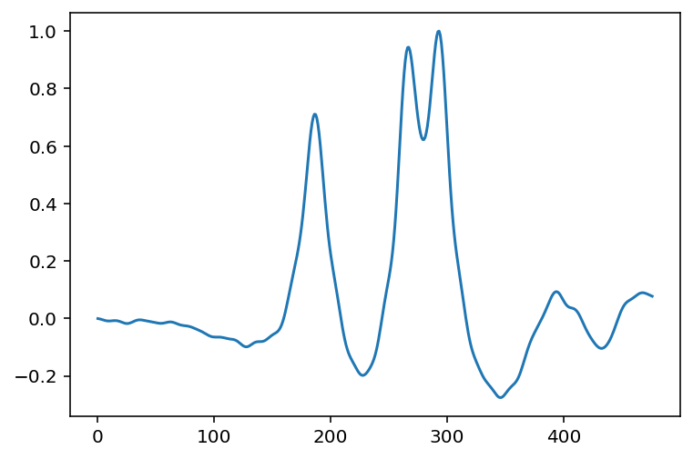

# Pregled AI rezultatov detekcije osi iz časovnih vrst

Ta dokument je osnovan na pregledu rezultatov obdelave datotek dobljenih s postopkom opisanim v  [axles.pdf](..\axles\axles.pdf).

Pregledanih je bilo 612 vozil iz testne možice, kjer se bodisi SiWIM ali AI rezultat ni ujemal z dejanskimi osmi. Rezultati so ločeni v več skupin, označenih s sledečo kodo `<D><R>
_<A>`, pri čemer so:

- `<D>` rezultat osnovne detekcije, `T` ali `F`, če je bila detekcija pravilna ali ne (referenca je ročno potrjeno število osi v skupinah)
- `<R>` rezultat rekonstrukcije, `T` ali `F`
- `
` rezultat popravkov. Vrednost je lahko:
  - `T`, če popravka ni bilo/ni bil potreben, 
  - `H`, če je bil popravek narejen s hevrističnim pristopom s skripto `fix.py`
  - `M`, če je bil popravek narejen ročno v *SiWIM-D*
- `<A>` rezultat AI

V datoteki  [comments.xlsx](comments.xlsx) so zbrani komentarji in opazke za vsako posamezno vozilo in procentualni povzetek napak, tukaj pa so povzetki opažanj.

## Splošne opazke

### Oddaljene osi

V veliko primerih je označeno, da je AI narobe detektiral osi, vendar jih je v resnici pravilno, saj je našel še kakšno oddaljeno os avtomobila ali kombija. Pri združevanju osi v vozila SiWIM-ov algoritem takšno posamezno os zavrže, če najde še kakšno za to osjo, pa naredi novo vozilo. Zato se takšne osi ne bi smele smatrati kot napake.

### Zamik osi

V precej primerih je prišlo do zamika osi. AI je detektiral osi skoraj pravilno, vendar je bil kriterij "pravilnosti" postavljen morda preostro - 1 vzorec. Pri ponovnem vzorčenju iz časovne v krajevno skalo je bil namreč izbran kvant 5 cm. S tem je kriterij 1 vzorec morda preoster in bi za primerjavo ali kontrolo SiWIM rezultatov zadostovali že 2-4 vzorci, 10-20 cm.

### Prekratek signal

V nekaterih primerih je pri pretvorbi signala očitno prišlo do rezanja uporabnega signala, na primer:,

kar je morda povzročilo napačno detekcijo AI, na primer:

To bi se dalo rešiti z reprocesiranjem signalov, vendar je vprašanje, ali se splača.

### Ročne napake

V nekaterih primerih sta bili narejena napaka tako pri ročnem popravljanju, kot pri pregledovanju slik, na primer: 

kjer je tovornjak imel dvignjeno tretjo os, druga os je bila ročno "popravljena" v dvojno, pri pregledovanju pa tega nismo opazili.

### Napačna rekonstrukcija

V množici **TFH_F** je pri vseh vozilih prišlo do napake rekonstrukcije. Prav v vseh primerih je slo za dvoosno vozilo (ponavadi avtobus), ki mu je rekonstrukcija zadnjo os napačno razcepila na dve (pri čemer je druga os v skupini bila zelo lahka), ker je s tem prišlo do izboljšanja ujemanja (manjšega $\chi^2$).

Hevristični popravki so drugo os v skupini zavrgli, niso pa premaknili prve osi nazaj na prej detektirano mesto. S tem se AI generirane osi niso ujemale s SiWIM. V resnici pa, če pogledaš signale, je AI odlično določila pozicijo osi, na primer:

## Posamezne množice

### FFH_T (17 vozil)

V vseh primerih sta sicer osnovna detekcija in rekonstrukcija določili napačne osi, vendar jih je potem hevristika pravilno popravila. Vse SiWIM in AI osi se ujemajo.

### FFM_T (3 vozila)

Ročni popravki so OK, ujemanje z AI je 100%

### FTT_T (177 vozil)

Tu ni kaj dosti povedati. Rekonstrukcija je pravilno dodala osi, s katerimi se AI 100% strinja

### FFH_F (5 vozil) 

- 2 primera: tovornjaka blizu en drugemu. AI pa je pravilno določil osi, hevristika v SiWIM ju je ločila, 
- 1 primer: AI izgubil legitimno os
- 1 primer: AI haluciniral (slaba slika težko preverljivo)
- 1 primer: oddaljena os

### FFM_F (28 vozil)

Pogosta napaka tukaj je zamik osi. Izgubljene so 3 osi, en primer je težak.

### FTT_F (183 vozil)

Pogosto izgubljene osi, pretežno pri praznih polpriklopnikih, kjer so osni pritiski trojne osi majhni v primerjavi z vlačilcem in osi niso izrazite.

Precej je tudi primerov, kjer rekonstrukcija ne deluje OK in se zato "baseline" medosne razdalje ne ujemajo z realnostjo.

### TFH_F (42 vozil)

Glej razdelek **Napačna rekonstrukcija**. Osi vseh vozil v tej množici je AI pravilno detektiral.

### TTT_F (157 vozil)

Pri tej množici je prišlo do dveh tipičnih napak. AI je rad izgubljal osi pri vozilih, ki so vozila po robu voznega pasu, kjer signali niso izraziti. Precejkrat pa je bila napaka v resnici na strani SiWIM-a, pri pregledu slik pa je nismo ulovili.

## Povzetek

Vseh vozil, ki so bila označena kot da je AI naredil napako, je 415. Od tega je 10 krat haluciniral (2%) in 156 krat izgubil os (38%). 

Če pa upoštevamo:

- Ghost oddaljene osi pravzaprav niso napaka,
- Toleranco za pozicijo lahko malo razširimo
- Ignoriramo napake kjer je prišlo do rezanja signala

je od 415 vozil 279 pravzaprav pravilnih. Se pravi, od 10153 vozil je bilo napačnih 136, kar ustreza 98.7% točnosti.